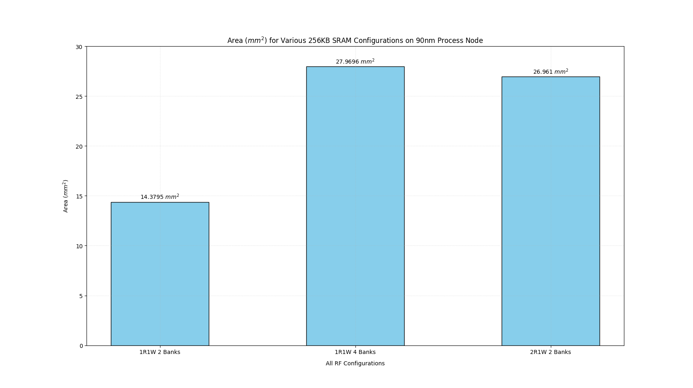

# GPU Hardware Register File P-Cacti Report

## By: Zach Barna

## Preface: This study is ongoing. Further SRAM configurations may be tested and our conclusions for the best configuration is subject to change. Check periodically for updates on additional PPA tests, as well as speedup comparisons within our hardware pipelines due to various SRAM configurations.

This study tested the access time (ns), cycle time (ns), area (mm2), and area efficiency (bytes/mm2) of various SRAM configurations for GPU Hardware's register file using pcacti simulations on a 90 nm process node. The original pcacti scripts were created by the AI Hardware team for design space exploration of their vector core register file, but the scripts were altered to accomodate for the size, r/w port, and banking configurations necessary for the GPU architecture. 

All SRAM configurations tested were of the same size, 256 KB. The register file needs to hold a maximum of 32 warp contexts per kernel, where each warp context has 64 registers of 1024 bits, hence the overwhelmingly large register file size.

Three port configurations were tested: 
- 1.) 1 dedicated read and 1 dedicated write port per bank. 
- 2.) 2 dual ports per bank (read/write through same port). 
- 3.) 2 dedicated read and 1 write port per bank.

For each of these configurations, a sweep for number of banks was tested as well from 1 to 64 banks within the SRAM, increasing in powers of 2 (i.e. 1, 2, 4, 8, ...).  

From preliminary testing, here are the results:

After further analyzing these results, we realized that a high number of banks will not be feasible due to the sheer amount of area that is required to implement the register file. Therefore, our initial conclusion for the most reasonable register file configurations based on the workload and architectural decisions made elsewhere in the hardware (i.e. issue policy, issue/fetch width, writeback buffer policies, etc.) were the 1 dedicated read and 1 dedicated write port per bank SRAM with 2 banks, the 1 dedicated read and 1 dedicated write port per bank SRAM with 4 banks, and the 2 dedicated read and 1 dedicated write port per bank SRAM with 2 banks.

Since access time is relatively comparable for the three highlighted configurations, and the cycle times of all three configurations meet our target system frequency of 600-700 MHz, the next graphs will focus purely on area (mm2) and area efficiency (bytes/mm2) of the highlighted configurations:

From the results above, it can be seen that the 1 dedicated read and 1 dedicated write port per bank SRAM with 4 banks and the 2 dedicated read and 1 dedicated write port per bank SRAM with 2 banks are roughly double the area (mm2) of the baseline register file (1R1W 2 Banks) on the 90 nm process node. In addition to this, it can also be seen that the area efficiency (bytes/mm2) of the 1 dedicated read and 1 dedicated write port per bank SRAM with 4 banks and the 2 dedicated read and 1 dedicated write port per bank SRAM with 2 banks are roughly half of the baseline register file (1R1W 2 Banks).

From here, further tests will be conducted to determine the area and area efficiency of other configurations not listed in the study so far. It is also imperative to mention that the pcacti simulations cannot account for performance of the entire system relative to the register file architecture, so although one design may appear to be an inferior option because it is double in area, it may speed up workloads within our hardware pipelines at a factor that we feel is reasonable to take on the increase in dedicated die area for the register file alone. 