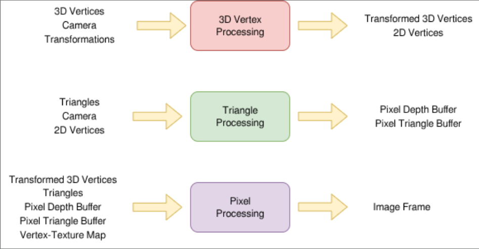
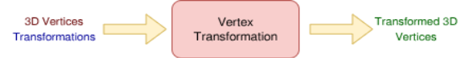
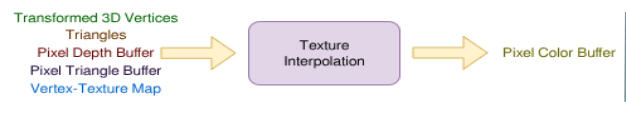

# Graphics CX01

## Programming Model

- The user will write a Host file that calls a GPU routine:
    - Setup of memory and files should be done by the Host
    - Define a struct per kernel containing GPU’s expected arguments
    - Hardware dimensions passed as arguments
    - Single Threaded tasks should always be done in Host
- Threadblocks, their dimension, and individual threads are all 1 dimensional:
    - Higher dimensions, like those in CUDA, are manually calculated by software

## Graphics Workflow



- Fixed-function graphics workflow
- Three software based shaders:
    - Vertex Shader 
    - Triangle Shader (Rasterization)
    - Pixel/Fragment Shader
- Implicit synchronization after each kernel Host call

### Vertex Shader


- Perform requested transformations
    - 3x3 matrix for rotations
    - Vector shift for point relocation


- Transform each Vertex to its 2D equivalent
relative to the camera

```
vertexShader(*3D_Verts, Camera, transformation, *t3D_Verts, *2D_Verts) {
    i := threadID + blockDim * blockID;
    curVert := 3D_Verts[i];
    curVert := ApplyTransformation(curVert, transformation);
    cur2DVert := Project(curVert, Camera);
    if(cur2DVert = NULL) then return;
    t3D_Verts[i] := curVert; 
    2D_Verts[i] := cur2DVert;
}
```

### Rasterization


- Perform initial rasterization of triangle
- Mark each pixel with the matching triangle and depth

```
triangleShader(*Tris, Camera, *2D_Verts, *Pix_Depth_Buff, *Pix_Tag_Buffer) {
	i := threadID + blockDim * blockID;
    tri := Tris[i];
    bounding_box := calcTriBoundingBox(tri);
    for pixel in bounding_box {
        if( “pixel is closer” ) {
            update Pix_Depth_Buff;
            update Pix_Tag_Buffer;
        }
    }
}
```

### Pixel Shader


- Perform Perspective corrected Barycentric Interpolation
- Find the texture mapped color

```
pixelShader(*t3D_Verts, *Tris, Camera, *vNorm, *Pix_Depth_Buff, 
 *Pix_Tag_Buffer,*texel_map, *frame_buffer) {
	i := threadID + blockDim * blockID;
	curPixel := <i*w%h, i%w>
	texel := textureInterpolation(t3d_Verts, Tris[i], 3D_Verts,  
 texel_map);
	frame_buffer[i] := texel;
}
```

## Results

- Rendered via workflow on CPU_SIM

### Teapot

<video width="400" height="400" controls>
  <source src="img/teapot1k_post_close.mp4" type="video/mp4">
  Your browser does not support the video tag.
</video>

### Cube

<video width="400" height="400" controls>
  <source src="img/cube_sideways.mp4" type="video/mp4">
  Your browser does not support the video tag.
</video>